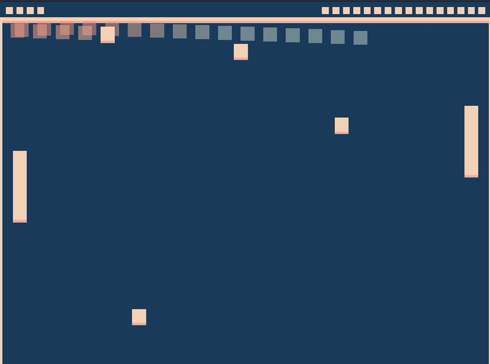

# Chaos Pong

Author: Katherine Wang

Design: In my game, the player can choose to release 3 extra balls into play by pressing any button, creating a more fast-paced and chaotic game of pong. The AI is also improved so that it can determine the closest ball to the AI paddle and quickly respond to it.

Screen Shot:

How To Play:

Move your mouse up and down to move your paddle (the left paddle). Press any button to release another ball. You can have up to 3 extra balls in play. The goal is to prevent balls from hitting your wall (left wall) and giving the opponent a point, while also trying to score points on the opponent's wall (right wall) by hitting it with balls.

Sources: None

This game was built with [NEST](NEST.md).
